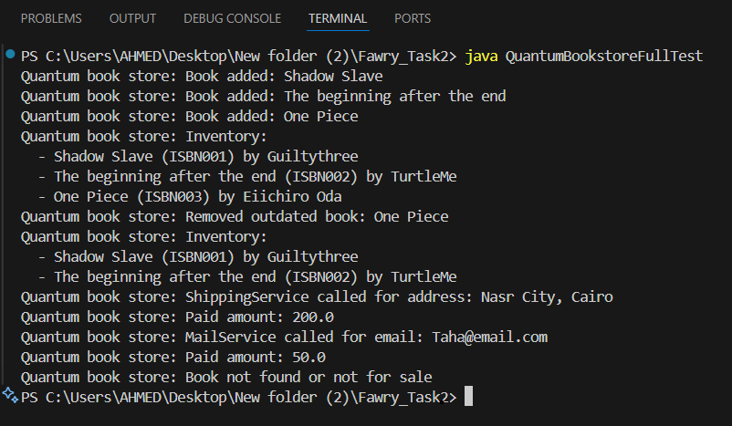

Quantum Book Store (Java)
========================

Overview
--------
This is a simple, extensible Java implementation of an online book store called "Quantum Book Store". The system supports multiple book types, inventory management, and basic purchase operations, all designed for easy future extension.

Features
--------
- Supports three book types:
  - PaperBook: Has stock, can be shipped
  - EBook: Has a file type, can be sent via email
  - ShowcaseBook: Not for sale, for display only
- Add books to inventory with details (ISBN, title, year, price, author)
- Remove outdated books based on publication year
- Buy books by ISBN (handles stock, errors, and simulates shipping/email)
- All output is prefixed with "Quantum book store"
- Easily extensible for new product types

Files
-----
- `Book.java`            : Abstract base class for all book types
- `PaperBook.java`       : Represents a physical book with stock
- `EBook.java`           : Represents a digital book with file type
- `ShowcaseBook.java`    : Represents a demo/showcase book (not for sale)
- `Inventory.java`       : Manages the collection of books and operations
- `QuantumBookstoreFullTest.java`: Test class demonstrating all features

How to Compile
--------------
Open a terminal in the project directory and run:

    javac *.java

How to Run
----------
After compiling, run the test class:

    java QuantumBookstoreFullTest

Example Output
--------------
    Quantum book store: Book added: Java Basics
    Quantum book store: Book added: Learn AI
    Quantum book store: Book added: Rare Book
    Quantum book store: Inventory:
      - Java Basics (ISBN001) by Alice Smith
      - Learn AI (ISBN002) by Bob Jones
      - Rare Book (ISBN003) by Carol White
    Quantum book store: Removed outdated book: Rare Book
    Quantum book store: Inventory:
      - Java Basics (ISBN001) by Alice Smith
      - Learn AI (ISBN002) by Bob Jones
    Quantum book store: Paid amount: 200.0
    Quantum book store: Paid amount: 50.0
    Quantum book store: Book not found or not for sale

Customization
-------------
To add new book types, simply extend the `Book` class and update the `Inventory` logic if needed.

output
-------------

